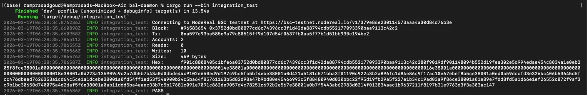

# bal-daemon

I am building `bal-daemon` as a Rust daemon that generates BEP-592 Block-Level Access List payloads for BSC block builders. It watches the chain tip, simulates pending transactions against the freshest state it can trust, and produces an RLP payload that a builder can attach to a block.

## Why It Matters

BEP-592 has been live on BSC since the Fermi hardfork in January 2026, but adoption is still close to zero because there is no simple tool that builders can run to generate these payloads automatically. This repo is my attempt to fix that gap with a focused daemon instead of a custom fork of the node.

## How It Works

The daemon listens for new heads and treats staleness as a first-class problem. If a new head arrives while simulation is still running, it cancels the old work, drops any stale access set, and starts again from the new state root reference.

It simulates multiple pending transactions in parallel, traces storage reads and writes with `debug_traceCall` plus `prestateTracer` in `diffMode`, merges the results into one `BlockAccessListEncode`, and then RLP-encodes the payload for output.

In short:

- new heads drive the simulation loop
- cancellation tokens prevent stale payloads
- transaction traces run in parallel
- `prestateTracer` extracts storage reads and writes
- the final payload is encoded with RLP and sanity-checked with tests

## How To Run

From the repo root:

```bash
cargo run --bin bal-daemon
```

The current daemon binary uses the NodeReal BSC testnet endpoints configured in `src/main.rs`.

## How To Test

I use the normal Rust test suite plus the integration binary:

```bash
cargo test && cargo run --bin integration_test
```


The integration test talks directly to NodeReal BSC testnet, walks back through recent blocks until it finds a contract interaction, traces it with `prestateTracer`, builds a BEP-592 payload, and verifies the RLP round-trip before reporting `PASS`.

## Issue

GitHub issue: https://github.com/bnb-chain/bsc/issues/3596

## Author

Ramprasad  
github.com/Ramprasad4121  
x.com/0xramprasad
